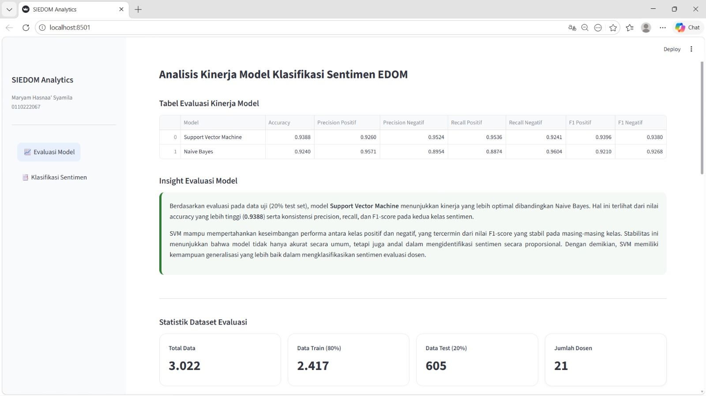

# 📊 Sistem Analisis Sentimen EDOM

Aplikasi berbasis **Streamlit** untuk menganalisis sentimen komentar mahasiswa terhadap dosen pada data EDOM (Evaluasi Dosen oleh Mahasiswa) menggunakan metode **Machine Learning**.

## 🚀 Fitur Utama

- Upload dataset Excel / CSV
- Pembersihan data komentar
- Analisis sentimen otomatis
- Visualisasi distribusi sentimen
- Perbandingan model klasifikasi
- Dashboard interaktif

---

## 📁 Struktur Folder

```bash
proyek-TA/
│── app.py
│── requirements.txt
│── README.md
│
├── datasets/
│   ├── edom-2024.csv
│   └── edom-2024-clean-balanced.csv
│
├── models/
│   ├── edom_indobert_naivebayes_all.joblib
│   └── edom_indobert_svm_all.joblib
│
└── venv/
```

---

## ⚙️ Teknologi yang Digunakan

- Python 3.10+
- Streamlit
- Pandas
- Scikit-learn
- Sentence Transformers
- PyTorch
- Plotly
- Joblib

---

## 💻 Cara Menjalankan Project

### 1. Clone repository

```bash
git clone https://github.com/maryamhasnaasyamila/sistem-klasifikasi-edom.git
cd sistem-klasifikasi-edom
```

### 2. Buat Virtual Environment

```bash
python -m venv venv
```

### 3. Aktifkan Virtual Environment

#### Windows (Git Bash)

```bash
source venv/Scripts/activate
```

#### Windows CMD

```bash
venv\Scripts\activate
```

---

### 4. Install Dependency

```bash
pip install -r requirements.txt
```

---

### 5. Jalankan Aplikasi

```bash
python -m streamlit run app.py
```

---

## 🌐 Akses di Browser

Setelah berhasil dijalankan:

```text
http://localhost:8501
```

---

## 📌 Catatan

Jika muncul error library, pastikan virtual environment aktif sebelum menjalankan aplikasi.

---

## 👤 Author

Maryam Hasnaa' Syamila

## Preview


